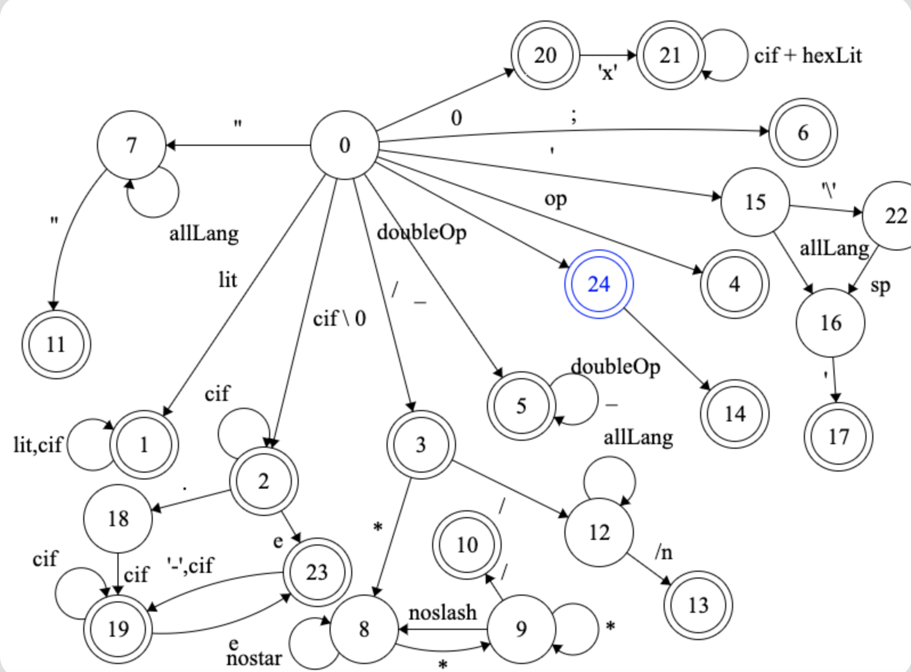

# C Lexical analyzer

This is a lexical analyzer for C language written in scala. This is based on the following DFA (deterministic finite automaton):
 - Q (finite set of states): {1, 2, 3,..., 24}
 - Σ (alphabet): {a,.., z, A,..., Z, 0,..., 9, ,, ., :,...} (all letters, digits and symbols)
 - Delta function (a transition function) delta: Q x Σ -> Q (the states for the function can be seen in the picture below)
 - q0 (initial state): 0
 - F (accept states): {1, 2, 3, 4, 5, 6, 10, 11, 13, 14, 17, 19, 20, 21, 23, 24}
 
 
 * lit = all letters
 * cif = all digits
 * op = all operators without doubleOp
 * allLang = Σ
 * doubleOp = {&, |, <, >, +, -, =, *}
 * hexLit = numbers and {a,..., f, A,..., F}
 
 tool used for creating the dfa: http://madebyevan.com/fsm/

